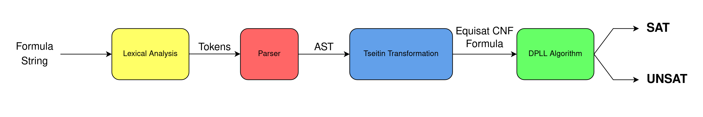
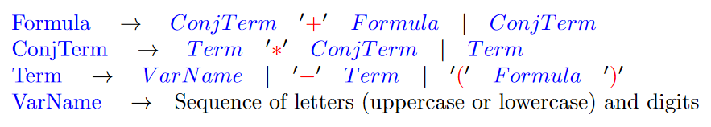

# Boolean SAT Solver

This Boolean SAT Solver can be used to determine satisfiability of boolean formulas. It works by taking an input string from the standard input and returning either `sat` or `unsat` in the standard ouput.

## How it Works
1. First the SAT Solver will take an input string from the standard input. It will then perform lexical analysis and break down the input string into tokens.
2. Next, the SAT Solver will use its parser to parse the tokens into an abstract syntax tree (AST). During the parsing process the SAT Solvers grammar will be checked, and errors will be thrown if needed.
3. Now the SAT solver will take the AST from the parser and perform Tseitins Transformation to convert it to an equisatisfiable Conjunctive Normal Form (CNF) formula. Tseitins Transformation is desirable because it can make this transformation in polynomial time.
4. Finally, the SAT Solver will use the DPLL algorithm to determine the satisfiablity of the CNF formula and return the results to the standard output.



## Grammar
Below outlines the grammar used by the SAT Solver.

### Operators:
1. `*`: represents the boolean AND operator
2. `+`: represents the boolean OR operator
3. `-`: represents the boolean NOT operator

### Order of Operations:
The order of operations will be enforeced as follows with `1` being the higest order and `4` being the lowest order.
1. `(` or `)` (Paranthesis)
2. `-` (NOT)
3. `*` (AND)
4. `+` (OR)

### Rules:
1. Variable names must start with a character of the alphabet (uppercase or lowercase)
2. Variable names can consist of letters and digits
3. Variable length must be less than 11 characters
4. Can use arbitrary amounts of whitespace between terms of the grammar

### Context Free Grammar (CFG):



Note that blue represents variables while red represents terminals.

### Examples:
Here are some examples of the grammar:
```
a+c
a*---a
 ( (-a)+(a*b)) * a * (c + -b) *-c
(a+b+c)*(a+b+-c)*(-b+a +c)*(-a*-c)
(a+b+c)*(a+b+-c)*(-b+a +c)*(a+-b+-c)*(-a+b+c)*(-a+b+-c)*(-a+-b+c)*(-a+-c+-c)
(a+b+c)*(a+b+-c)*(-b+a +c)*(a+-b+-c)*(-a+b+c)*(-a+b+-c)*(-a+-b+c)*(-a+-c+-b)
(a+b+c)*(a+b+-c)*(-b+a +c)*(a+-b+-c)*(-a+b+c)*(-a+b+-c)*(-a+-b+c)
VAr1 * -VAr1
VAr1 + -VAr1
 -((A*  B)+ C)
 (A+-B+C) * (B+C) * (-A+ C) * (B +-C) * -               (C)
(a1)*(-a1+a2) * (-a2+a3) *(-a3)
  (-B*-C * D) + (-B * -  D) + (C *D) + (B)         
(B+C+-D)  *(D+B)*(-C+-D)* (-B)
```

## Compiling/Running the Program
The SAT Solver can be easily compiled/run on most versions of Linux (Ubuntu, POP!_OS, etc.). All that needs to be done to compile the SAT Solver is a `make`, and then it can be run using `./sat`.

The process of compiling and running the SAT Solver with a few examples from the root directory should look like this:
```
sh-5.1$ make
g++ -std=c++14 -g -Wall -MMD -Werror=vla   -c -o main.o main.cc
g++ -std=c++14 -g -Wall -MMD -Werror=vla   -c -o tokenizer.o tokenizer.cc
g++ -std=c++14 -g -Wall -MMD -Werror=vla   -c -o treeNode.o treeNode.cc
g++ -std=c++14 -g -Wall -MMD -Werror=vla   -c -o parser.o parser.cc
g++ -std=c++14 -g -Wall -MMD -Werror=vla   -c -o tseitinTransformer.o tseitinTransformer.cc
g++ -std=c++14 -g -Wall -MMD -Werror=vla   -c -o solver.o solver.cc
g++ -std=c++14 -g -Wall -MMD -Werror=vla main.o tokenizer.o treeNode.o parser.o tseitinTransformer.o solver.o -o sat
sh-5.1$ ./sat
a123
sat
a+c
sat
a*---a
unsat
(a+b+c)*(a+b+-c)*(-b+a +c)*(a+-b+-c)*(-a+b+c)*(-a+b+-c)*(-a+-b+c)
sat
```

## Testing
The repo also has some tests in the `tests` directory. Inputs can be seen in `test0.in` and there expected outputs in `test0.out`. A shell for running the tests is available using the following command:
```
bash ./test.sh
```